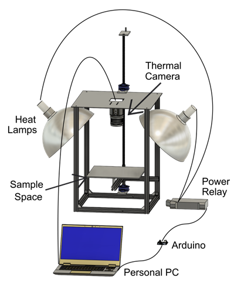
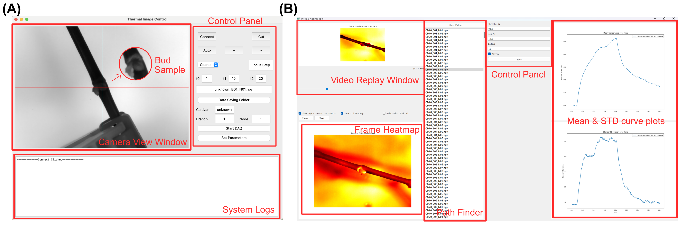
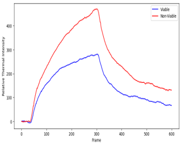
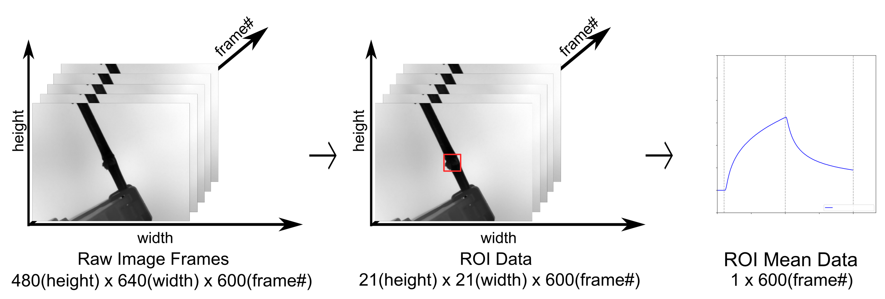
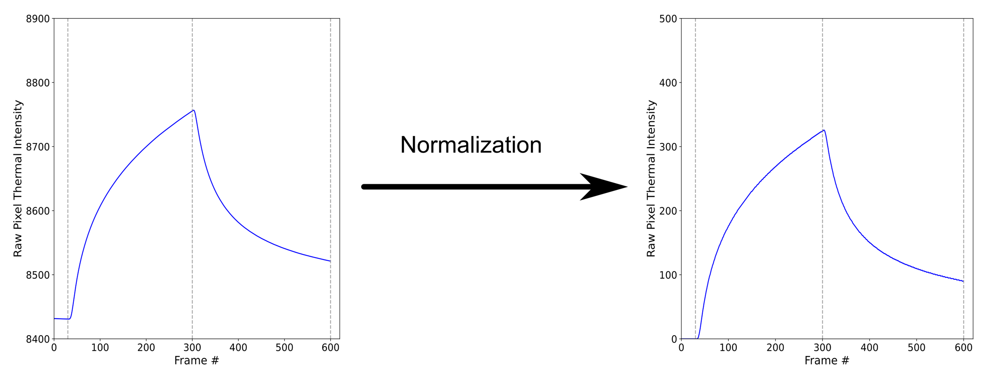
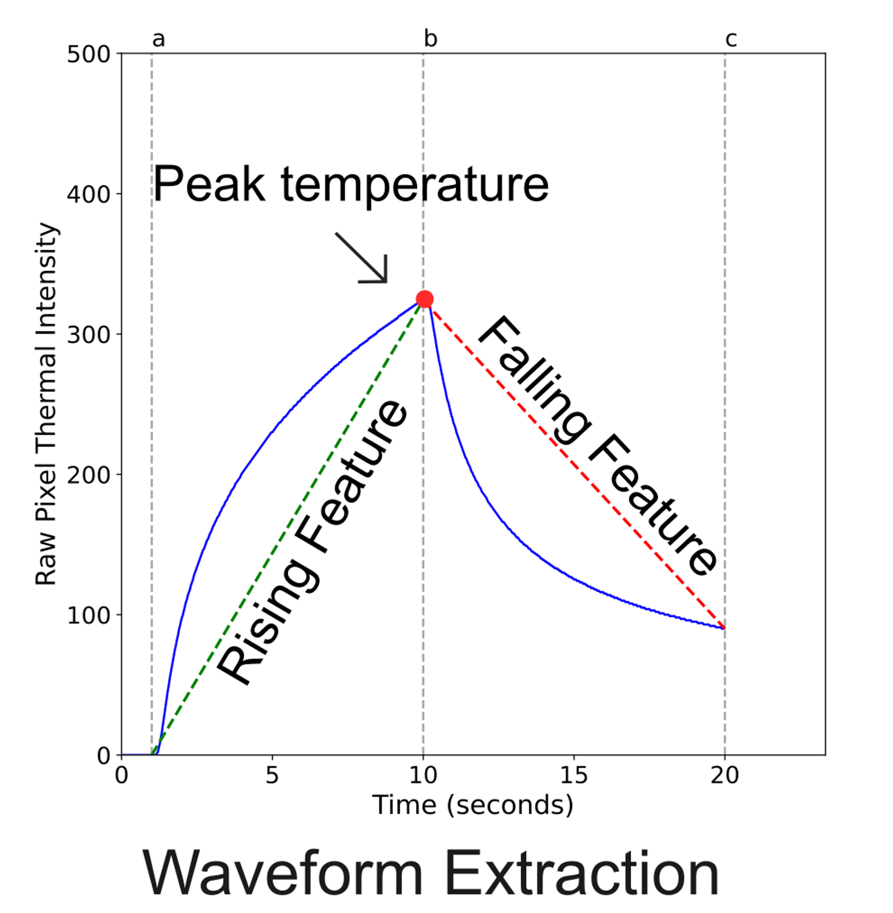
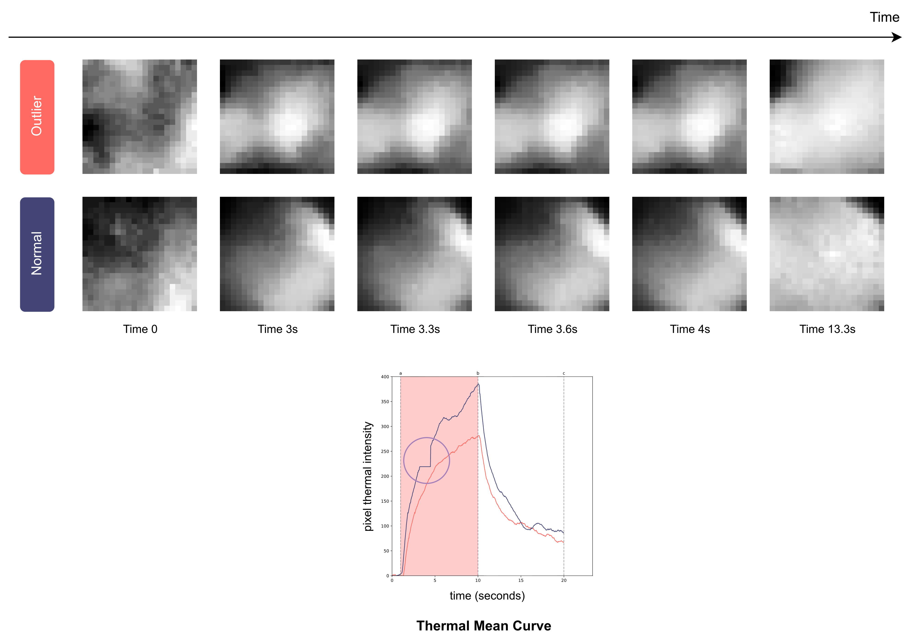
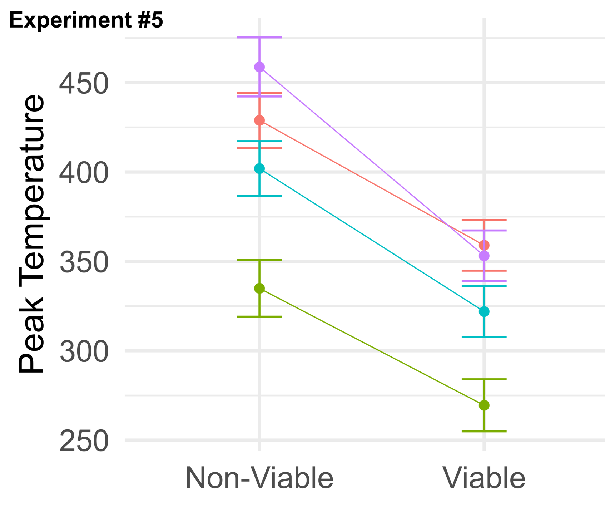

[]()
[]()
[]()
# Active Thermography for Non-destructive Determination of Bud Mortality for Grapes: System Design and Capability

This directory contains all code, data organization, and documentation related to **Manuscript I**, which focuses on the **design, implementation, and validation of an active thermography system** for non-destructive grape-bud mortality assessment.

---

## 🎯 Research Objectives

- Engineer and document a custom, synchronized pulsed-thermography acquisition system and companion software to collect standardized heating–cooling sequences at the bud scale
-  Quantify separability by extracting informative waveform features and applying a principled statistical analysis plan (mixed-effects modeling) to compare intact vs damaged buds within cultivars
- Investigate mechanisms and factors that can explain differences in thermal responses and guide protocol design

---

## 🔧 Hardware System

The active thermography system consists of a synchronized heating and thermal imaging setup designed for repeatable, high-resolution measurements.

**Core components include:**
- Pulsed heat excitation source
- High-resolution thermal camera
- Custom mounting and alignment fixtures
- Hardware triggering and synchronization

📷 **Hardware System overview**



## 💻 Software System

Two graphical user interfaces (GUIs) were developed to support data collection and quality control:

### 1️⃣ Acquisition GUI
- Controls heating pulse timing
- Synchronizes thermal image acquisition
- Ensures consistent acquisition parameters across experiments

### 2️⃣ Validation GUI
- Real-time visualization of thermal frames
- ROI placement and inspection
- Metadata annotation and sample tracking



---

## 📊 Data Products

### Thermal ROI Data
- Format: `.npy`
- Shape: `21 × 21 × 600` (spatial × spatial × time)
- One file per grape bud sample

Each file represents the spatiotemporal thermal response of a single bud during a controlled heating–cooling cycle.

### Metadata & Feature Tables
Stored as `.csv` files containing:
- Experimental metadata (`cultivar`, `treatment`, `dev_stage`, `cane`, `segment`)
- Mortality ground truth
- Extracted waveform features
- PCA components derived from time-series data

---

## 🎥 Example Thermal Responses

Below is a qualitative comparison of thermal behavior between viable and non-viable buds.

- **Viable bud:** smooth rise during heating, gradual decay during cooling
- **Non-viable bud:** altered slope, delayed response, or suppressed amplitude

📈 **Mean time-series curve comparison**



---

## 🧩 ROI Extraction & Preprocessing

### Region of Interest (ROI) Extraction
- Bud-centered ROIs extracted from thermal frames
- Fixed spatial size to ensure consistency across samples



### Temporal Normalization
- Frame-wise normalization to control for baseline temperature variation
- Ensures comparability across sessions and cultivars



### Feature Engineering
Features extracted from heating and cooling phases include:
- Rising and falling slopes
- Peak temperature
- Temporal variability metrics



---

## ⚠️ Data Quality Control

Certain samples exhibit abnormal thermal responses (e.g., non-physical box-shaped heating curves), typically caused by:
- Sensor artifacts
- Misalignment
- Improper heating contact

These samples are:
- Explicitly identified
- Stored in separate folders or labeled in metadata
- **Excluded from modeling and statistical analysis**



---

## 📐 Statistical Analysis

To evaluate whether thermal responses differ systematically between viable and non-viable buds, we apply:

- Mixed-effects modeling to account for:
  - Cultivar
  - Treatment
  - Experimental round
  - Cane and segment effects
- Within-cultivar comparisons to isolate mortality effects



These analyses establish the **statistical separability** of mortality states and motivate the modeling work in Manuscript II.

---

## 📌 Notes

This manuscript focuses on **system engineering, experimental validation, and statistical capability analysis**.
No machine-learning model benchmarking or predictive performance comparisons are reported here.

For modeling and classification analysis, see **Manuscript II**:

➡️ [`Manuscript II — Modeling & Analysis`](../model_analysis/README.md)

---

## 🗂️ Code Structure & Function

All source code lives under `code/` and is organized into three parts that mirror the experimental pipeline.

```
code/
├── DataAcquisition/
│   ├── dataAcquisitionGUI.py   # Part 1 — main data acquisition GUI used for collecting the data
│   └── arduino_control.py      # utility code for manual relay control testing
├── DataValidation/
│   ├── main.py                 # Part 2 — data validation GUI entry point
│   ├── app_window.py           # Main validation / annotation window
│   ├── data_process.py         # Signal processing utilities
│   ├── experiment_params.py    # Centralised parameter config
│   ├── mpl_canvas.py           # Matplotlib-in-PyQt5 canvas widget
│   ├── cache.py                # Computation cache helper
│   └── data_analysis.py        # Additional analysis helpers
├── data_analysis/
│   └── statistics/
│       ├── abnormals.py        # Master list of excluded samples
│       ├── abnormal_remover.ipynb
│       ├── preprocess_csv.ipynb
│       ├── roi_data_generate.ipynb
│       ├── plot_curves.ipynb
│       ├── glme_stage2–6.r     # Statistics Test R files for all experiments
│       └── flow_chart.ipynb
├── sound.py
└── requirements.txt
```

---

### Part 1 — Data Acquisition (`DataAcquisition/`)

#### `dataAcquisitionGUI.py`
The primary data-collection application. A PyQt5 window that wraps the FLIR PySpin SDK and an Arduino relay controller to execute precisely timed heating–cooling experiments.

**Key classes:**

| Class | Role |
|---|---|
| `VideoThread` | QThread — streams live thermal video to the preview pane |
| `VideoThread_timed` | QThread — runs a timed acquisition: pre-heat (`t0`), heat (`t1`), cool-down (`t2`), controls the Arduino relay, converts raw Mono16 pixels to radiometric temperature using camera calibration constants (R, B, F, X, α, β, J0, J1), and saves output |
| `App` | Main window — focus control (coarse / fine / ±), parameter entry, auto-incremented sample naming (`cultivar_branch_node`) |
| `SubParameterGUI` | Secondary window for environmental parameters (emissivity, ambient temperature, humidity, distance) |

**Inputs:** Live 480×640 thermal frames (Mono16), GUI parameters (timing, naming, save path), Arduino on COM3.
**Outputs:** `.npy` array (uint16, frames × H × W) + `.cfg` parameter file per sample.

#### `arduino_control.py`
Minimal CLI script. Sends `1` / `0` to Arduino pin 12 over serial to manually toggle the heating relay. Used for bench-testing outside the full GUI.

---

### Part 2 — Data Validation & ROI Annotation (`DataValidation/`)

#### `app_window.py` — `ThermalAnalysisApp`
Interactive PyQt5 GUI for reviewing raw `.npy` files, selecting bud ROIs, and labelling mortality.

**Key workflows:**
- Load a folder of `.npy` files; navigate frames with a slider.
- Identify the top-N thermally-sensitive pixels (highest σ over a user-defined time window) and overlay them as red dots.
- Click to place ROI centre points; each centre is highlighted with a numbered hollow square.
- Toggle **Alive / Dead** label per sample (`A` key).
- Save ROI centre coordinates or full 7×7 (or 21×21) pixel-region time-series to CSV (`S` / `K` keys).
- Multi-plot mode for side-by-side curve comparison across ROIs.

**Keyboard shortcuts:** `Space` = next file · `Z` = revert last point · `A` = toggle label · `K` = save ROI data · `S` = save centre coords.

#### `data_process.py`
Pure-function signal-processing module consumed by `app_window.py`.

| Function | Description |
|---|---|
| `find_top_sensitive_pixels()` | Returns the top-N pixel coordinates ranked by standard deviation over a given time window; restricts candidates to the central image region and applies an intensity threshold mask |
| `mask_pixel_filter()` | Masks pixels below threshold and outside the inner 2/3 of the frame |
| `extract_mean_val()` | Given a list of centre points and a radius, returns the frame-wise mean and σ curves for each ROI |

#### `experiment_params.py` — `ExperimentParameter`
Dataclass holding system-wide defaults: `fps=30`, heating window bounds, `threshold=9400`, `roi_radius=15`, `interested_points_num=1000`. Changing values here propagates to all dependent modules.

#### `mpl_canvas.py` — `MplCanvas`
Thin wrapper around `FigureCanvasQTAgg` that renders frames with a `'hot'` colormap and optionally registers mouse-click callbacks for interactive point selection.

#### `cache.py` — `ComputationCache`
Simple container (top_points, std_dev, last_params) to memoize expensive pixel-sensitivity computations across re-renders.

---

### Part 3 — Statistical Analysis (`data_analysis/statistics/`)

#### R scripts (`glme_stage2.r` – `glme_stage6.r`)
Each script fits a generalised linear mixed-effects model (GLME) at a progressively refined modelling stage. Random effects account for cultivar, treatment, experimental round, cane, and segment. The results quantify whether thermal features are statistically separable between viable and non-viable buds.

---

### Shared Utility

#### `requirements.txt`
Core dependencies: `PyQt5`, `PySpin` (FLIR SDK), `opencv-python`, `numpy`, `matplotlib`, `Pillow`, `pyFirmata`, `pyserial`.

---

## Citation

If you use this repository in academic research, please cite:

```bibtex
@article{zhai2026thermography,
  title={Active Thermography for Non-destructive Determination of Bud Mortality for Grapes},
  author={Zhai, Guangxun and Jiang, Yu and Owens, John and Vanden Heuvel, Justine and Zoubi, Alan},
  journal={Under Review},
  year={2026}
}
```

---

## License

This project is released under the MIT License.

See [LICENSE](LICENSE) for details.

